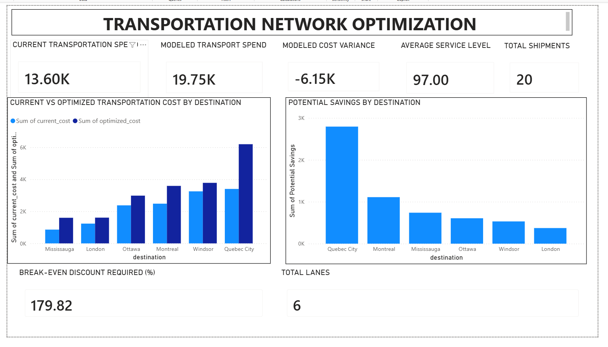

# Data Validation & Analysis - Transportation Dataset

## Overview

This project is a simulated supply chain transportation analysis created as part of my supply chain and solution architect portfolio.

The goal of the project was to analyze different transportation lanes and understand how carrier choices could impact transportation costs and service levels. I also wanted to evaluate whether switching carriers would make financial sense.

I first developed the transportation cost models in Excel and then recreated a large portion of the analysis in PostgreSQL. The SQL portion of the project focuses on building a data model, creating data validation rules, performing transportation cost analysis, and developing reusable views that can support reporting in tools such as Power BI or Tableau.

All data used in this project is simulated.

---

## Business Problem

Choosing the lowest carrier rate is not always the best decision. A lower transportation cost may come with risks if the carrier does not meet the required service level.

For this analysis, I evaluated carrier options based on both cost and service performance. Carriers were required to meet a minimum service level of **95%** before they could be considered as an option.

The model was designed to answer the following questions:

* What are the lowest-cost carrier options for each lane that still meet the service level requirement?
* What service level is associated with each carrier option?
* How do the modeled carrier costs compare with the current transportation cost?
* Which lanes provide the best opportunities for carrier negotiations?
* How much would a carrier rate need to decrease to justify switching carriers?

---

## Data Model

The PostgreSQL database contains three primary tables.

### Shipments

This table contains the transportation lanes used in the analysis.

Key fields include:

* Shipment ID
* Destination
* Number of shipments
* Current transportation cost

### Carrier Rates

This table contains simulated carrier pricing for each destination.

Key fields include:

* Rate ID
* Destination
* Carrier
* Carrier cost

### Carrier Service

This table contains service-level performance information for each carrier, along with the minimum required service level.

Key fields include:

* Carrier
* Service level
* Minimum service level

---

## Analysis Approach

The analysis follows this process:

1. Validate the source data.
2. Join carrier pricing with carrier service performance.
3. Remove carriers that do not meet the 95% minimum service requirement.
4. Rank the remaining carriers by cost within each destination.
5. Select the lowest-cost eligible carrier.
6. Compare the modeled cost with the current transportation cost.
7. Calculate potential savings and cost variance.
8. Calculate the break-even discount required to make a carrier switch financially worthwhile.
9. Create reusable SQL views for lane-level and executive reporting.
10. Use the results to build dashboards in Excel and Power BI.

---

## SQL Skills Used

The project includes:

* Creating tables
* Inserting data
* Filtering and sorting
* INNER JOINs
* Aggregate functions
* GROUP BY and HAVING
* CASE statements
* Common Table Expressions (CTEs)
* Window functions
* ROW_NUMBER() and PARTITION BY
* Data validation queries
* Creating reusable SQL views

---

## Key Business Rule

A carrier is only considered for optimization if its service level meets or exceeds the required minimum.

```sql
service_level >= minimum_service_level
```

This prevents the model from simply choosing the lowest-cost carrier without considering service performance.

---

# Power BI Dashboard

The Power BI dashboard provides a summary of the transportation network and highlights the main cost and service metrics.

The dashboard includes:

* Current Transportation Spend
* Modeled Transport Spend
* Modeled Cost Variance
* Average Service Level
* Total Shipments
* Current vs. Optimized Transportation Cost by Destination
* Potential Savings by Destination
* Break-Even Discount Required
* Total Lanes



---

# Excel Dashboard

The Excel dashboard was used as part of the original transportation cost modeling and analysis.

It provides another view of the transportation data and helps compare costs, carrier options, and service performance.


---

## Project Structure

```text
Transportation-Network-Optimization/
│
├── README.md
│
├── Transportation_Network_SQL/
│   ├── 01_create_tables.sql
│   ├── 02_insert_data.sql
│   ├── 03_network_analysis.sql
│   ├── 04_break_even_analysis.sql
│   ├── 05_data_validation.sql
│   ├── 06_create_views.sql
│   ├── 07_carrier_eligibility.sql
│   ├── 08_executive_reporting.sql
│   ├── 09_scenario_analysis.sql
│   ├── 10_operational_feasibility.sql
│   └── 11_data_quality_summary.sql
│
├── excel/
│   ├── Transportation_Network_Optimization.xlsx
│   └── Excel_dashboard.png
│
└── powerbi/
    ├── PowerBI dashboard.pbix
    └── dashboard_screenshot.png
```

---

## Project Takeaway

This project helped me practice combining SQL, Excel, and Power BI in one end-to-end analysis.

The main focus was not just finding the lowest transportation cost. The analysis also considered service performance and the financial impact of switching carriers.

The final result is a transportation analysis that moves from data modeling and SQL analysis to Excel and Power BI reporting.
